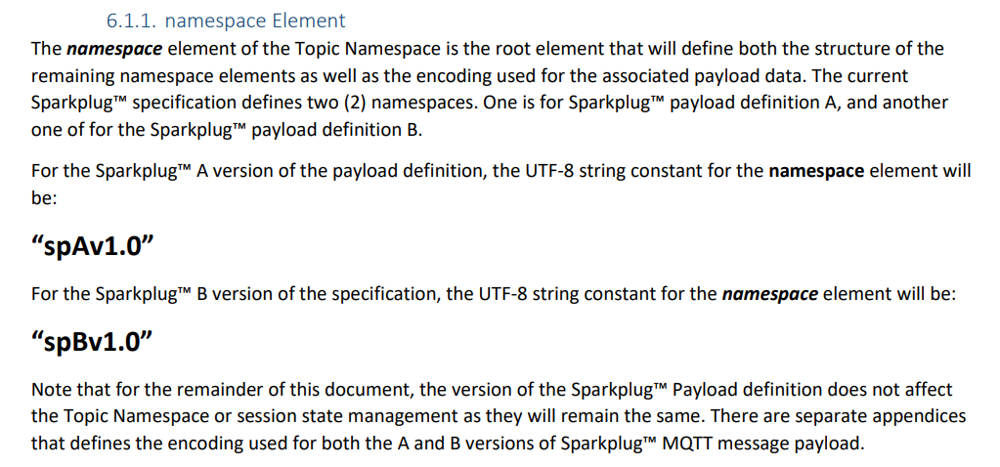
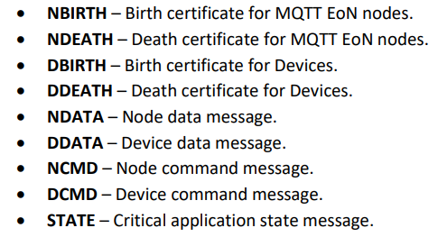

# MQTT

## ```Overview```
This Python script is a Sparkplug B MQTT client that can be used to connect to an MQTT broker, publish birth certificates, and respond to commands and messages sent to it.

## ``Prerequisites``
Before running this script, ensure you have the following:

- Python 3.x installed on your system.
- The Paho MQTT library installed. You can install it using pip:

> pip install paho-mqtt

# Configuration Variables

- `serverUrl`:  MQTT broker's address or hostname that the script will connect to.``(Ensures that the script connects to the correct broker)``
- `myGroupId`: Defines the group ID associated with the MQTT client.
- `myNodeName`: Represents the name of the node or device within the MQTT network.
- `myDeviceName`: Specifies the name of the specific device or client within the node.
- `publishPeriod`: Determines the time interval (in milliseconds) at which data is published to the MQTT broker.
- `myUsername`: Specifies the username used for authenticating with the MQTT broker.
- `myPassword`: Represents the password used for authentication.

# MQTT Topic Structure

 In our MQTT-based communication system, we use a structured topic naming convention to organize and categorize messages. 
# The topic name follows the format
  >  <span style="font-size: 17px;"> ``namespace/group_id/message-type/edge-node-id/device-id``

# Example Topic Construction:
    namespace = "spBv1.0"
    group_id = "myGroup1"
    message_type = "NCMD"
    edge_node_id = "node123"
    device_id = "device456"



 - ``'group_id'`` identifies the group or logical grouping of MQTT clients.

# Message_type Element



- ``'edge_node_id'`` identifies a specific edge node or device.

- ``'device_id'`` identifies a specific device or subcomponent within the edge node.

For more information - [Sparkplug_b documentation](https://sparkplug.eclipse.org/specification/version/2.2/documents/sparkplug-specification-2.2.pdf) (Page No. 12)


# MQTT Birth and Death Messages

MQTT "birth" and "death" messages are used to announce the birth or initial connection of a client to the MQTT broker and its disconnection or "death" from the broker. These messages are helpful for monitoring the online/offline status of MQTT clients, such as devices or applications.

### ```Birth Message```

A "birth" message is sent by an MQTT client when it initially connects to the broker. It can include information about the client, such as its client ID, the topic it will publish to, and a message indicating its connection status.

     # Example Birth message

     client.will_set("myClient/status", payload="Online", qos=1, retain=True)

In this example, the will_set method is used to configure a birth message. When the client connects, it will publish "Online" to the "myClient/status" topic. This message is typically published by the broker if the client disconnects unexpectedly.

### ```Death Message```

A "death" message, also known as a "last will and testament," is sent by the broker on behalf of a client when the client disconnects unexpectedly. It informs other clients and systems that the client has gone offline.

    # Example Death Message

    client.will_set("myClient/status", payload="Offline", qos=1, retain=True)

In this example, the will_set method is used to configure a death message. If the client disconnects unexpectedly, the broker will publish "Offline" to the "myClient/status" topic, indicating the client's status change.

- ```Purpose```: Birth and death messages enable real-time monitoring of MQTT client status, ensuring timely responses to unexpected disconnections or reconnections. They enhance the reliability and robustness of your MQTT application.

# Quality of Service (QoS)

- ```QoS 0```: Messages are delivered once or not at all (no guarantee).
- ```QoS 1```: Messages are delivered at least once (may be duplicated).
- ```QoS 2```: Messages are delivered exactly once (highest reliability).

