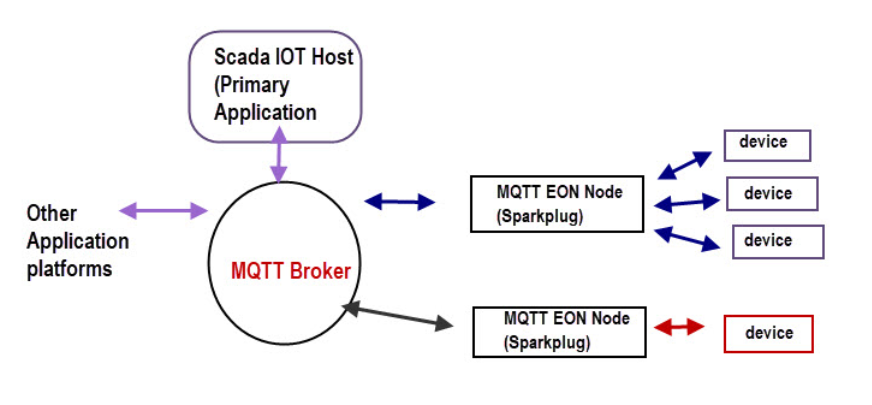

# Sparkplug B 

## Overview
This section provides an overview of the Sparkplug B library (`sparkplug_b`) and the associated Protocol Buffers (protobuf) definitions (`sparkplug_b_pb2`) used in the Python script.

### `sparkplug_b` Library
 The library provides essential functionality for creating Sparkplug B payloads, including birth and data messages, and handling common MQTT communication tasks.

### `sparkplug_b_pb2` - Protobuf Definitions
The `sparkplug_b_pb2` module contains the Protocol Buffers (protobuf) definitions required to serialize and deserialize Sparkplug B payloads. Protocol Buffers are a language-agnostic method for serializing structured data, making it easier to exchange data between different systems and programming languages. These protobuf definitions ensure compatibility with Sparkplug B message formats.

## Usage
In your Python script, you import these modules to work with Sparkplug B payloads. The `sparkplug_b` module provides functions for creating birth and data payloads, while the `sparkplug_b_pb2` module defines the structure of Sparkplug B messages.

# Payloads and Messages


# [Google Protocol buffers](https://github.com/Cirrus-Link/Sparkplug/blob/master/sparkplug_b/sparkplug_b.proto)

## uses

- Efficient Serialization and Deserialization

## how to convert google proto file for other launguages 

1. ``Install Protocol Buffer Compiler ('protoc')``
    [download](https://github.com/protocolbuffers/protobuf)

2. ```download proto file``` [download](https://github.com/Cirrus-Link/Sparkplug/blob/master/sparkplug_b/sparkplug_b.proto)

3. ```Compile the .proto File```
    
    Use the protoc compiler to generate code for your chosen programming language. You'll need to specify the language-specific plugin and output directory. For example, to generate Python code:

    >protoc --python_out=output_directory your_file.proto

    Replace output_directory with the desired directory and adjust the command according to your target language (e.g., --java_out for Java, --csharp_out for C#, etc.).


```N Birth``` refers to the birth certificate of a Sparkplug B device or node.

```D Birth``` is specifically related to data points or variables associated with a device. when a new device available it sends a ```D Birth```

```N Node```(Node State) is refers to the node state message in Sparkplug B. 

```D Node```(Data Node) is similar to "N Node" but is specific to data points or variable associated with a device or node. 

always convey the state and values of data points. 

Device can be subscribe  to receive updates on the values of specific data.